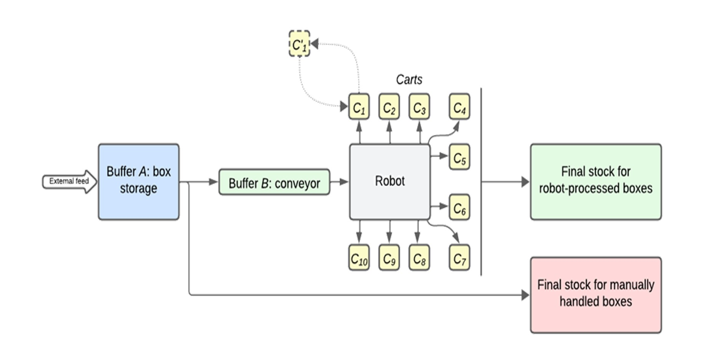
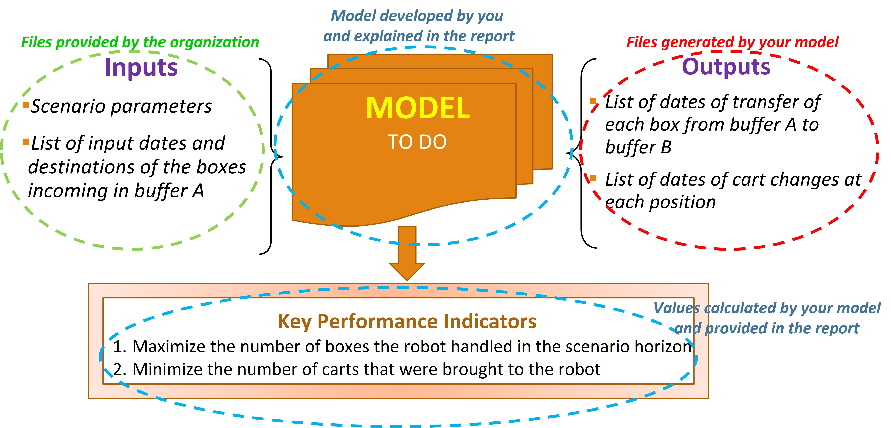
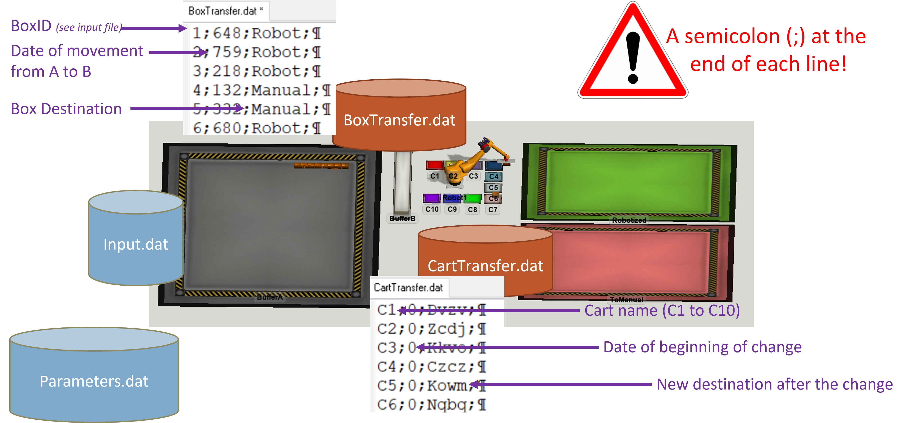

# Benchmark Problem. "The Flexibac problem"
## Industrial context
The problem is extracted from an industrial collaboration between the group La Poste (French postal services) and Nantes University. The purpose of this collaboration was to define suitable control strategies for an existing mail sorting system in which a 6-axis robot was going to be introduced. The overall project was called Flexibac, and a schematic representation of the expected result can be seen in the following figure. Pictures of the actual implementation of the robot cannot be shown due to confidentiality issues. 

This project addresses critical operational challenges in mail distribution centers. In the current system, mail is stored in boxes weighing approximately 20kg each, with 250 different possible destinations. Human operators manually move these boxes from outputs to carts that are later transported to trucks. The system handles between 10,000 to 35,000 boxes daily, creating significant physical strain on workers and risks of musculoskeletal disorders. To address this, a robotic solution was introduced where a robot loads carts with mail containers, ensuring each cart contains boxes sharing the same destination (homogeneous carts). The system faces several operational constraints:

 - While there are 250 possible container destinations, only 10 carts can be positioned around the robot at any time.
 - Each robot operation takes approximately 5 seconds to handle a container.
 - Cart changes, whether full or not, require about 1 minute to complete.
 - Each cart has a fixed capacity that cannot be exceeded.

Thus, the key decisions in this system revolve around two main questions:

 - Cart allocation: Which destination carts should be placed around the robot throughout the production period to optimize the overall system performance?
 - Box handling distribution: Which boxes should be handled by the robot versus manually by operators, considering the system's constraints and efficiency goals?

These decisions directly impact both the system's throughput and the reduction of physical strain on human operators, making them crucial for the overall success of the automation project.

## Introduction

This benchmark study bridges both qualitative and quantitative research approaches, with a primary focus on operational performance metrics while carefully considering real-world practical constraints. Positioned at the intersection of intelligent manufacturing control, operational research, industrial automation, industrial engineering, and logistics optimization, the study aims to enhance the design and control strategies of robotic mail sorting systems while simultaneously addressing the critical need to reduce human physical strain. The contribution is twofold: (i) theoretical, through advancing knowledge in robotic control strategies, and (ii) empirical, by delivering practical solutions ready for industrial implementation. The research seeks to validate scheduling algorithms, planification and decision-making processes specifically designed for robot-assisted sorting systems. The expected outcomes include optimal or near-optimal solutions that will maximize robotic handling efficiency while minimizing both manual operations and cart changes, ultimately providing a comprehensive framework for improving automated mail sorting operations.

A synthetic [presentation of the contest](Students_Presentation.pdf), to be used to introduce the contest to the teams is available [here](Students_Presentation.pdf).

## Glossary

To ensure clear communication and shared understanding among all stakeholders, this section provides definitions of key terms and parameters used throughout the problem description. Each term is accompanied by its common synonyms to maintain consistency across different experimentations. 

|      **Key terms**     |          **Synonyms**           |                                    **Definition**                                          | 
| :--------------------: | :-----------------------------: | :----------------------------------------------------------------------------------------: | 
|  Buffer A              | Input buffer                    |  Main storage area for incoming boxes with limited capacity Amax                           | 
|  Buffer B              | Conveyor  buffer                |  Robot input conveyor with limited capacity Bmax                                           | 
|  Available cart slots  | Cart positions                  |  Maximum number of carts that can be positioned around the robot simultaneously (Nc)       |
|  Cart                  | Container                       |  Storage unit placed around the robot with fixed capacity Qmax                             |
|  Cycle time            | Handling time                   |  Time needed for the robot to pick and place one box (Tp)                                  |
|  Cart change time      | Changeover time                 |  Fixed duration needed to replace a cart (Tc)                                              |
|  Completion date       | Time horizon, Planning horizon  |  Total duration of the scenario to be considered for planning and optimization (EndDate)   |

## Considered topology 

The physical layout and interaction between system components play a crucial role in understanding the constraints and opportunities for optimization. While the actual industrial system encompasses a complex network of conveyors and workstations, we present here a simplified yet representative model that captures the essential elements and their relationships. Thus, to facilitate understanding and avoid misinterpretation, the complex industrial sorting system has been deliberately simplified into a schematic topology, as illustrated in the following figure, highlighting the key elements: the Input buffer A, the Conveyor buffer B, the robotic cell, the cart positions as well as the final stocks for both robot-processed boxes and the manually handled boxes. 

## Goals

The Flexibac problem addresses multiple objectives that balance operational efficiency with practical constraints. The following goals have been established to guide the development and evaluation of competing solutions, with special attention to both automated and manual operations management:
- The solution shall enable to maximize the number of boxes handled by the robot in a 24-hour period
- The solution shall enable to minimize the number of cart changes required from operators
- The solution shall enable to respect all system constraints (buffer capacities, cycle times, cart capacities)
- The solution shall enable to handle online (real-time) and/or offline (pre-planned) scenarios

## Metrics

To objectively evaluate and compare different solutions, a set of performance indicators has been established. These metrics are designed to measure both the primary objectives of maximizing robotic handling efficiency and the secondary considerations of operational feasibility and system sustainability. The following quantitative and qualitative indicators will be used to assess the performance of proposed solutions:

|           **Name**          |                         **Definition**                           |   **Unit**  |
| :-------------------------: | :--------------------------------------------------------------: | :---------: |
|  Robot handling rate        | Number of boxes handled by the robot in a 24h period             | Boxes/day   |
|  Cart changes               | Number of cart changes performed during the operation period     | Changes/day |
|  Buffer A occupation        | Maximum number of boxes in buffer A vs. maximum capacity (Amax)  | Boxes       |
|  Buffer B occupation        | Maximum number of boxes in buffer B vs. maximum capacity (Bmax)  | Boxes       |
|  Cart filling rate          | Maximum number of boxes in each cart vs. maximum capacity (Qmax) | Boxes       |
|  Solution computation time  | Time needed to calculate the solution (both categories)          | Seconds     |

## Categories and problems
The IMIC'25 contest offers two distinct simulation categories to evaluate the competing solutions, each with its own set of challenges and objectives. Additionally, the problem instances vary in terms of complexity, testing the limits of the proposed solutions across different dimensions of the system.

### Online Simulation Category:
The online simulation category focuses on developing robust solutions that can adapt to dynamic, real-time changes in the input stream, without any prior knowledge of the boxes to be handled. In this category:

- Contestants have no prior knowledge of the input list of boxes to be handled. However, a statistical analysis of the global inputs can be tolerated if correctly defined and explained. 
- The focus is on developing robust solutions that can adapt to dynamic, real-time changes in the input stream.
- Submissions in this category will be tested on their ability to make effective, reactive decisions without relying on complete information in advance.

### Offline Simulation Category:
In contrast, the offline simulation category allows contestants to leverage complete information about the problem instance, aiming to find optimal or near-optimal solutions through more comprehensive planning and optimization techniques. In this category:
- Contestants are provided with the full list of input boxes and their destinations before execution.
- The goal is to find optimal or near-optimal solutions by leveraging complete information about the problem instance.
- While less representative of real-world conditions, this category allows for the exploration of solution techniques that may not be feasible in the online setting.

### Problems:
Beyond the categorization by simulation approach, the contest also includes problem instances of varying size and complexity, testing the limits of the proposed solutions:
- Variability: The number of different destinations for the mail containers can range up to 260, increasing the complexity of cart allocation decisions.
- Volume: The total number of boxes to be handled within the 24-hour scenario can reach up to 30,000, pushing the throughput capabilities of the robotic system.
- Solution Space Size: The number of carts that can be positioned around the robot may be as high as 10, expanding the combinatorial search space for optimal cart configurations.

To ensure a comprehensive evaluation, the contest will provide multiple data instances for each problem, allowing contestants to demonstrate the robustness and consistency of their solutions.

## Work overview
The model developed by the contestants must accept a set of inputs provided by the contest organizers and generate specific outputs that will be used to assess the performance of the proposed solutions. As we can see in the following figure, that outlines the required inputs, the expected outputs, and the key performance indicators that will be used to evaluate the submissions.

The inputs for different instances will be provided by the contest organizers, including the scenario parameters and the list of input boxes and destinations. Based on these inputs, the contestant's model must generate two specific output files: one detailing the dates of box transfers from the input buffer to the robot, and another listing the dates of cart changes around the robot. in addition, The performance of the submitted solutions will be evaluated against key metrics, which seek to balance the primary objective of maximizing robotic handling with the secondary goal of minimizing manual cart changes.
<!--
## Input and Output files Description (To be finalized)
<!-- link to the presentation of william

## Instances Description (To be finalized)
-->

<!--## Benchmark exercises

Benchmark exercises are test cases that serve to evaluate rival solutions.

*Guidelines:*

1. A benchmark exercise is a representative example problem of the actual problem for which the solutions are intended.
2. Authors should reuse existing benchmark exercises and not invent new ones, unless they have a very specific illustrative purpose not covered by existing ones.
3. The lack of showing particular benchmark exercises in a manuscript says more than those included in a manuscript.
4. Any change to existing benchmark exercises must be motivated and explained in the discussion of the repository (e.g. navigate to '*Repositories > Benchmark-0_Template > Discussions*' or [click here](https://github.com/GIS-S-mart/Benchmark-0_Template/discussions). Once the community informally approves the suggested change, the author shall post on the issues page of the benchmark (e.g. navigate to *Repositories > Benchmark-0_Template > Issues*, or [click here](https://github.com/GIS-S-mart/Benchmark-0_Template/issues)) and briefly outline the new benchmark exercises.
5. A benchmark exercise shall be stored on an open online repository (to be selected according to the type and size of the dataset, licensing, etc.) such as [Zenodo](https://zenodo.org/), [Recherche Data Gouv](https://entrepot.recherche.data.gouv.fr/dataverse/root), [Harvard Dataverse](https://dataverse.harvard.edu/), [4TUandand.and ResearchData](https://data.4tu.nl/info/en/), [B2SHARE](https://eudat.eu/catalogue/B2SHARE), and [B2DROP](https://eudat.eu/catalogue/B2DROP) with a preference for repositories such as [Zenodo,](https://zenodo.org/) which creates a persistent identifier (DOI) for the repository. This helps for [referencing and citing a  GitHub repository](https://docs.github.com/fr/repositories/archiving-a-github-repository/referencing-and-citing-content).
6. If the benchmark exercise is not stored in the benchmark GitHub repository, contributors should specify the hyperlink to the source.
7. An existing benchmark exercise may be modified according to the feedback of members of the benchmark community. It is important to specify the version of the benchmark exercise so that candidate solutions can be evaluated using the latest version.

*Template:*

| **Name** | **Author(s)** | **Version** | **DOI** | **URL** | **License** |
| :------: | :-----------: | :---------: | :-----: | :-----: | :---------: |
|          |               |             |         |         |             |

## Solutions

A solution is a candidate theory, process, method, practice, [...], or software that aims to solve a benchmark exercise.

*Guidelines:*

1. It is imperative for good scientific practice that all results are reproducible.
2. It is strongly recommended that the research material (e.g., software code—at least an executable file -, model, simulation, coding book, interviews, statistics, raw data, observation voice/video recordings, etc.) be published.
3. The quantitative and/or qualitative metrics serve as a level of evidence which can be of four types:
   1. **Measured**: the benefit is measured through a measurement protocol.
   2. **Observed**: the benefit is noticed by the researcher(s) but is not measured through a measurement protocol.
   3. **Perceived**: The benefit—claimed without evidence—is expected or perceived to be evident by the researcher(s), but the claim is not based on a measurement protocol.
   4. **Reference** to another source: the benefit is cited from another source.

*Template:*

| **Name** | **Author(s)** | **Version** | **DOI** | **URL** | **License** | Evidence |
| :------: | :-----------: | :---------: | :-----: | :-----: | :---------: | -------- |
|          |               |             |         |         |             |          |

## Measurement protocols

A measurement protocol is a logical and repeatable procedure for evaluating metrics when using a candidate solution to solve a benchmark exercise. It ensures the successful replication of results by others. The recipe highly depends on the preferred research approach (quantitative empirical studies, qualitative empirical studies, mixed-methods studies, analytical studies, experiments, quasi-experiments, ethnographic research, phenomenological research, grounded theory, hermeneutics, case study research, action research, etc.). A measurement protocol may be solution agnostic or part of a candidate solution.

*Guidelines:*

1. 
2. 

*Template:*

## Benchmarking

Benchmarking shall enable visitors to determine which solution is better to employ in a specific context.

*Guidelines:*

1. When presenting a new solution, results must be quantitatively and not only qualitatively compared to the literature.
2. The comparison of solutions must be done in a fair and transparent manner.
3. Results should also be critically judged for physical sanity to avoid the ones that make little sense.

*Template:*

## Meta-Analysis

A meta-analysis integrates the findings by analysing all of the benchmark results. Meta-analytic results are the most trustworthy source of evidence.

## References

*Guidelines:*

- Please use the Harvard format to list references supporting any data (keyword definition, goal, metric, benchmark exercise, solution, etc.) of the benchmark.
- Make sure to provide the DOI of the document.

*Template:*

- **Book, one author:** Bell, J. (2010) *Doing your research project*. 5th edn. Maidenhead: Open University Press.

- **One author, book, multiple editions:** Hawking, S.W. (1998) *A brief history of time: From the big bang to black holes*. 10th edn. New York: Bantam Doubleday Dell Publishing Group.

- **Chapter in an edited book:** Jewsiewicki, B. (2010). ‘Historical Memory and Representation of New Nations in Africa’, in Diawara, M., Lategan, B., and Rusen, J. (eds.) *Historical memory in Africa: Dealing with the past, reaching for the future in an intercultural context*. New York: Berghahn Books, pp. 53-66.

- **More than three authors, journal article:** Shakoor, J., et al. (2011) ‘A prospective longitudinal study of children’s theory of mind and adolescent involvement in bullying’, *Journal of Child Psychology and Psychiatry*, 53(3), pp. 254–261. doi: 10.1111/j.1469-7610.2011.02488.x.

- **Conference papers:** Drogen, E. (2014) ‘Changing how we think about war: The role of psychology’, *The British Psychological Society 2014 Annual Conference*. The ICC, Birmingham British Psychological Society, 07-09 May 2014.

- **Web page, by an individual:** Moon, M. (2019) *Ubisoft put an official video game design course inside a video game*. Available at https://www.engadget.com/2019/09/25/ubisoft-video-game-design-course/ (Accessed 19 November 2019).

- **Web page, by a company or organization:** RotoBaller (2019) *NFL player news*. Available at https://www.rotoballer.com/player-news?sport=nfl (Accessed 17 September 2019). -->

